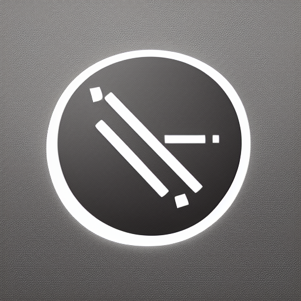

<a name="readme-top"></a>
[![Contributors][contributors-shield]][contributors-url]
[![Forks][forks-shield]][forks-url]
[![Stargazers][stars-shield]][stars-url]
[![Issues][issues-shield]][issues-url]
[![MIT License][license-shield]][license-url]

<!-- PROJECT LOGO -->
<br />
<div align="center">
  <a href="https://github.com/0xStabby/TabletTools">
    
  </a>

<h3 align="center">TabletTools</h3>

  <p align="center">
    Customizable Toolbar for hotkeys. Useful for using linux applications through a tablet.
    <br />
    <a href="https://github.com/0xStabby/TabletTools"><strong>Explore the docs »</strong></a>
    <br />
    <br />
    <a href="https://github.com/0xStabby/TabletTools/issues">Report Bug</a>
    ·
    <a href="https://github.com/0xStabby/TabletTools/issues">Request Feature</a>
  </p>
</div>


<!-- TABLE OF CONTENTS -->
<details>
  <summary>Table of Contents</summary>
  <ol>
    <li>
      <a href="#about-the-project">About The Project</a>
      <ul>
        <li><a href="#built-with">Built With</a></li>
      </ul>
    </li>
    <li>
      <a href="#getting-started">Getting Started</a>
      <ul>
        <li><a href="#prerequisites">Prerequisites</a></li>
        <li><a href="#installation">Installation</a></li>
      </ul>
    </li>
    <li><a href="#usage">Usage</a></li>
    <li><a href="#roadmap">Roadmap</a></li>
    <li><a href="#contributing">Contributing</a></li>
    <li><a href="#license">License</a></li>
    <li><a href="#contact">Contact</a></li>
    <li><a href="#acknowledgments">Acknowledgments</a></li>
  </ol>
</details>


<!-- ABOUT THE PROJECT -->
## About The Project

[![Tablet Tools Screen Shot][product-screenshot]](https://github.com/0xStabby/TabletTools)

Customizable Toolbar for hotkeys. Useful for using linux applications through a tablet.

_Currently 4 buttons(Toggle Alt, Toggle Shift, Right Click, Undo)._

<p align="right">(<a href="#readme-top">back to top</a>)</p>


### Built With

* [![c][c]][c-url]
* [![gtk][gtk]][gtk-url]

<p align="right">(<a href="#readme-top">back to top</a>)</p>


<!-- GETTING STARTED -->
## Getting Started

This is an example of how you may give instructions on setting up your project locally.
To get a local copy up and running follow these simple example steps.

### Prerequisites

This is an example of how to list things you need to use the software and how to install them.
* Install dependencies through your package manager
  ```sh
  sudo apt install xdotool gtk4 gcc
  ```

### Installation

1. Clone the repo
   ```sh
   git clone https://github.com/0xStabby/TabletTools.git
   cd TabletTools
   ```
2. Build Tablet Tools
   ```sh
   gcc $(pkg-config --cflags gtk4) -o tablet-tools tablet-tools.c $(pkg-config --libs gtk4)

   ```
3. Run 
   ```sh
   ./tablet-tools
   ```

<p align="right">(<a href="#readme-top">back to top</a>)</p>


<!-- USAGE EXAMPLES -->
## Usage

[![Tablet Tools with Blender Screen Shot][blender-gif]](https://github.com/0xStabby/TabletTools)

TabletTools being used to help navigation in blender running on linux through tablet

<p align="right">(<a href="#readme-top">back to top</a>)</p>


<!-- ROADMAP -->
## Roadmap

- [x] Toggle Alt
- [x] Toggle Shift
- [x] Right Click
- [x] Undo
- [ ] Redo
- [ ] Zoom/Scroll
- [ ] Copy
- [ ] Paste
- [ ] Possibly more customizability yet

See the [open issues](https://github.com/0xStabby/TabletTools/issues) for a full list of proposed features (and known issues).

<p align="right">(<a href="#readme-top">back to top</a>)</p>


<!-- CONTRIBUTING -->
## Contributing

Contributions are what make the open source community such an amazing place to learn, inspire, and create. Any contributions you make are **greatly appreciated**.

If you have a suggestion that would make this better, please fork the repo and create a pull request. You can also simply open an issue with the tag "enhancement".
Don't forget to give the project a star! Thanks again!

1. Fork the Project
2. Create your Feature Branch (`git checkout -b feature/AmazingFeature`)
3. Commit your Changes (`git commit -m 'Add some AmazingFeature'`)
4. Push to the Branch (`git push origin feature/AmazingFeature`)
5. Open a Pull Request

<p align="right">(<a href="#readme-top">back to top</a>)</p>


<!-- LICENSE -->
## License

Distributed under the MIT License. See `LICENSE.txt` for more information.

<p align="right">(<a href="#readme-top">back to top</a>)</p>


<!-- CONTACT -->
## Contact

Twitter: [@0xStabby](https://twitter.com/0xStabby)

Project Link: [https://github.com/0xStabby/TabletTools](https://github.com/0xStabby/TabletTools)

<p align="right">(<a href="#readme-top">back to top</a>)</p>


<!-- ACKNOWLEDGMENTS -->
<!--
## Acknowledgments

* [Something could go here]()

<p align="right">(<a href="#readme-top">back to top</a>)</p>
-->


<!-- MARKDOWN LINKS & IMAGES -->
<!-- https://www.markdownguide.org/basic-syntax/#reference-style-links -->
[contributors-shield]: https://img.shields.io/github/contributors/0xStabby/TabletTools.svg?style=for-the-badge
[contributors-url]: https://github.com/0xStabby/TabletTools/graphs/contributors
[forks-shield]: https://img.shields.io/github/forks/0xStabby/TabletTools.svg?style=for-the-badge
[forks-url]: https://github.com/0xStabby/TabletTools/network/members
[stars-shield]: https://img.shields.io/github/stars/0xStabby/TabletTools.svg?style=for-the-badge
[stars-url]: https://github.com/0xStabby/TabletTools/stargazers
[issues-shield]: https://img.shields.io/github/issues/0xStabby/TabletTools.svg?style=for-the-badge
[issues-url]: https://github.com/0xStabby/TabletTools/issues
[license-shield]: https://img.shields.io/github/license/0xStabby/TabletTools.svg?style=for-the-badge
[license-url]: https://github.com/0xStabby/TabletTools/blob/master/LICENSE.txt
[product-screenshot]: images/TabletTools-with-Blender.jpeg
[blender-gif]: images/TabletTools-with-Blender_Quality.gif
[c-url]: https://www.cprogramming.com/
[c]: https://img.shields.io/static/v1?style=for-the-badge&message=C&color=222222&logo=C&logoColor=A8B9CC&label=
[gtk-url]: https://www.gtk.org/
[gtk]: https://img.shields.io/static/v1?style=for-the-badge&message=GTK&color=222222&logo=GTK&logoColor=7FE719&label=
